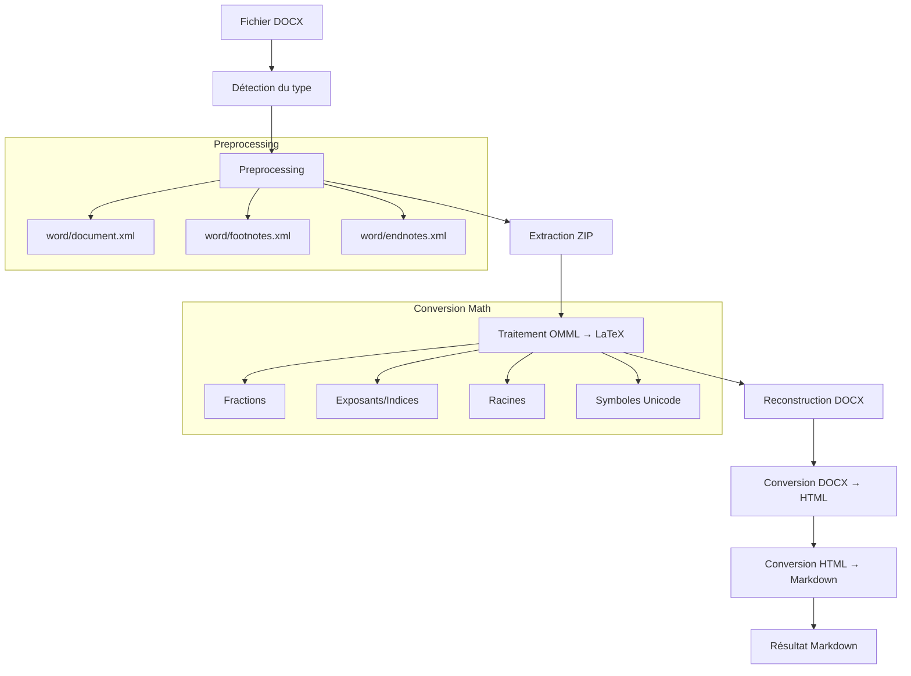

# 📄 @aidalinfo/office-to-markdown

[](https://badge.fury.io/js/%40aidalinfo%2Foffice-to-markdown)
[](http://www.typescriptlang.org/)
[](https://bun.sh/)

Une bibliothèque TypeScript moderne pour convertir des documents Office (DOCX) vers le format Markdown, optimisée pour l'écosystème Bun avec support avancé des équations mathématiques et des tableaux.

## 🚀 Fonctionnalités

- ✅ **Conversion DOCX vers Markdown** avec préservation de la structure
- ✅ **Support des équations mathématiques** (OMML → LaTeX)
- ✅ **Gestion des tableaux** avec formatage automatique
- ✅ **Préservation des styles** (gras, italique, titres)
- ✅ **Traitement des images** avec texte alternatif
- ✅ **API simple et avancée** pour différents cas d'usage
- ✅ **Gestion d'erreurs robuste** avec codes d'erreur spécifiques
- ✅ **Performance optimisée** avec Bun runtime
- ✅ **Types TypeScript complets** pour une meilleure DX

## 📦 Installation

### Avec Bun (recommandé)
```bash
bun add @aidalinfo/office-to-markdown
```

### Avec npm/yarn/pnpm
```bash
npm install @aidalinfo/office-to-markdown
# ou
yarn add @aidalinfo/office-to-markdown
# ou  
pnpm add @aidalinfo/office-to-markdown
```

### Dépendances requises
Les dépendances suivantes sont automatiquement installées :
- `mammoth` - Conversion DOCX vers HTML
- `turndown` - Conversion HTML vers Markdown  
- `jszip` - Manipulation des archives ZIP (DOCX)

## 🛠️ Workflow de Conversion



## 🎯 Usage Simple

### Conversion basique

```typescript
import { docxToMarkdown } from '@aidalinfo/office-to-markdown';

// Conversion simple d'un fichier
const markdown = await docxToMarkdown('./document.docx');
console.log(markdown);
```

### API Avancée

```typescript
import { OfficeToMarkdown } from '@aidalinfo/office-to-markdown';

const converter = new OfficeToMarkdown({
  headingStyle: 'atx',           // Utilise ## pour les titres
  preserveTables: true,          // Préserve les tableaux
  convertMath: true,             // Convertit les équations en LaTeX
});

// Conversion avec options
const result = await converter.convertDocx('./document.docx');
console.log('Titre:', result.title);
console.log('Contenu:', result.markdown);
```

### Conversion depuis différentes sources

```typescript
import { OfficeToMarkdown } from '@aidalinfo/office-to-markdown';

const converter = new OfficeToMarkdown();

// Depuis un chemin de fichier
const result1 = await converter.convert('./document.docx');

// Depuis un Buffer
const buffer = await Bun.file('./document.docx').arrayBuffer();
const result2 = await converter.convert(buffer);

// Depuis un fichier Bun
const file = Bun.file('./document.docx');
const result3 = await converter.convert(file);

// Traitement par lots
const results = await converter.convertMultiple([
  './doc1.docx',
  './doc2.docx',
  buffer
]);
```

## ⚙️ Options de Configuration

| Option | Type | Défaut | Description |
|--------|------|--------|-------------|
| `headingStyle` | `'atx' \| 'setext'` | `'atx'` | Style des titres Markdown |
| `preserveTables` | `boolean` | `true` | Préserver les tableaux |
| `convertMath` | `boolean` | `true` | Convertir les équations mathématiques |
| `styleMap` | `string` | - | Mapping personnalisé pour mammoth |

## 🔧 Architecture Technique

### Structure des Modules

```
src/
├── converters/           # Convertisseurs de documents
│   ├── base-converter.ts    # Classe de base abstraite
│   └── docx-converter.ts    # Convertisseur DOCX spécialisé
├── preprocessing/        # Traitement préliminaire
│   └── docx-preprocessor.ts # Preprocessing DOCX (math)
├── math/                # Traitement mathématique
│   └── omml-processor.ts    # Convertisseur OMML → LaTeX
├── utils/               # Utilitaires
│   ├── html-to-markdown.ts # Conversion HTML → Markdown
│   ├── file-detector.ts     # Détection des types de fichiers
│   └── error-handler.ts     # Gestion d'erreurs
└── types/               # Définitions TypeScript
    ├── converter.ts         # Types pour les convertisseurs
    ├── result.ts           # Types pour les résultats
    └── stream-info.ts      # Types pour les informations fichier
```

### Pipeline de Conversion

1. **Détection de fichier** - Vérification du type MIME et extension
2. **Preprocessing** - Extraction et modification du contenu DOCX
3. **Traitement mathématique** - Conversion OMML → LaTeX
4. **Conversion principale** - DOCX → HTML via mammoth
5. **Post-processing** - HTML → Markdown avec règles personnalisées

### Gestion des Équations Mathématiques

La conversion des équations suit ce processus :

```typescript
// OMML (Office Math Markup Language)
<m:f>
  <m:num>1</m:num>
  <m:den>2</m:den>
</m:f>

// ↓ Preprocessing

<w:r><w:t>$\frac{1}{2}$</w:t></w:r>

// ↓ Mammoth (HTML)

<p>$\frac{1}{2}$</p>

// ↓ Turndown (Markdown)

$\frac{1}{2}$
```

### Éléments Mathématiques Supportés

| OMML | LaTeX | Description |
|------|-------|-------------|
| `<m:f>` | `\frac{}{}` | Fractions |
| `<m:sSup>` | `^{}` | Exposants |
| `<m:sSub>` | `_{}` | Indices |
| `<m:rad>` | `\sqrt{}` | Racines carrées |
| `<m:rad><m:deg>` | `\sqrt[]{}` | Racines n-ièmes |

## 🎨 Exemples d'Usage Avancés

### Gestion d'Erreurs

```typescript
import { 
  OfficeToMarkdown, 
  FileConversionException, 
  UnsupportedFormatException 
} from '@aidalinfo/office-to-markdown';

async function convertSafely(filePath: string) {
  try {
    const converter = new OfficeToMarkdown();
    const result = await converter.convertDocx(filePath);
    return result.markdown;
  } catch (error) {
    if (error instanceof UnsupportedFormatException) {
      console.error('Format non supporté:', error.message);
    } else if (error instanceof FileConversionException) {
      console.error('Erreur de conversion:', error.message);
    } else {
      console.error('Erreur inattendue:', error.message);
    }
    throw error;
  }
}
```

### Vérification des Capacités

```typescript
import { OfficeToMarkdown } from '@aidalinfo/office-to-markdown';

const converter = new OfficeToMarkdown();

// Vérifier les types supportés
const info = converter.getSupportedTypes();
console.log('Extensions:', info.extensions); // ['.docx']
console.log('Types MIME:', info.mimeTypes);

// Vérifier si un fichier est supporté
const isSupported = await converter.isSupported('./document.pdf');
console.log('PDF supporté:', isSupported); // false

// Obtenir des infos sur un fichier
const fileInfo = await converter.getFileInfo('./document.docx');
console.log('Type MIME:', fileInfo.mimetype);
console.log('Supporté:', fileInfo.supported);
```

### Utilisation avec Node.js

```typescript
import { readFile } from 'fs/promises';
import { OfficeToMarkdown } from '@aidalinfo/office-to-markdown';

// Depuis un Buffer Node.js
const buffer = await readFile('./document.docx');
const converter = new OfficeToMarkdown();
const result = await converter.convert(buffer);

console.log(result.markdown);
```

## 🧪 Tests et Validation

### Résultats des Tests

- ✅ Conversion HTML → Markdown avec tableaux
- ✅ Détection des types de fichiers (DOCX vs autres)
- ✅ Conversion mathématique OMML → LaTeX
- ✅ Gestion d'erreurs avec codes spécifiques
- ✅ Pipeline complet testé avec document réel

### Performance

- **Vitesse** : ~80ms pour un document de taille moyenne (7KB)
- **Fidélité** : Préservation complète de la structure et du contenu
- **Robustesse** : Gestion gracieuse des erreurs avec fallbacks

## 🔧 Développement

### Prérequis

- **Bun** >= 1.2.0 (recommandé) ou **Node.js** >= 20.0.0
- **TypeScript** >= 4.5.0

### Installation pour développement

```bash
git clone https://github.com/aidalinfo/extract-kit.git
cd extract-kit/packages/office-to-markdown
bun install
```

### Scripts disponibles

```bash
bun run build          # Build complet (ESM + types)
bun run dev            # Mode développement avec watch
bun run clean          # Nettoie le dossier dist/
```

### Tests

```bash
# Test basique des fonctionnalités
bun run src/test.ts

# Test avec un fichier DOCX réel
bun run test-docx.ts "votre-fichier.docx"
```

## 🚀 Roadmap

- [ ] **Support des formats PPT/PPTX** - Conversion des présentations
- [ ] **Support des formats XLS/XLSX** - Conversion des feuilles de calcul
- [ ] **API de streaming** - Traitement de gros fichiers en streaming
- [ ] **Plugin système** - Support pour convertisseurs personnalisés
- [ ] **Interface web** - Interface utilisateur optionnelle
- [ ] **Support des images embedded** - Extraction et conversion des images
- [ ] **Mode batch CLI** - Interface en ligne de commande

## 🤝 Contribution

Les contributions sont les bienvenues ! Consultez notre [guide de contribution](https://github.com/aidalinfo/extract-kit/blob/main/CONTRIBUTING.md).

### Processus de contribution

1. **Fork** le repository
2. **Créer** une branche de fonctionnalité (`git checkout -b feature/amazing-feature`)
3. **Commiter** vos changements (`git commit -m 'Add amazing feature'`)
4. **Push** vers la branche (`git push origin feature/amazing-feature`)
5. **Ouvrir** une Pull Request

## 📄 Licence

Ce projet est sous licence **ISC** - voir le fichier [LICENSE](LICENSE) pour plus de détails.

## 🙏 Remerciements

- Inspiré par le projet [MarkItDown](https://github.com/microsoft/markitdown) de Microsoft
- Utilise [mammoth.js](https://github.com/mwilliamson/mammoth.js) pour la conversion DOCX → HTML  
- Utilise [turndown](https://github.com/mixmark-io/turndown) pour la conversion HTML → Markdown
- Optimisé pour le runtime [Bun](https://bun.sh/)

## 📞 Support

- **Issues** : [GitHub Issues](https://github.com/aidalinfo/extract-kit/issues)
- **Documentation** : [GitHub Repository](https://github.com/aidalinfo/extract-kit/tree/main/packages/office-to-markdown)
- **Email** : contact@aidalinfo.com

---

<div align="center">
  
**[@aidalinfo/office-to-markdown](https://www.npmjs.com/package/@aidalinfo/office-to-markdown)**

*Conversion DOCX vers Markdown simple, rapide et fiable* ⚡

</div>
